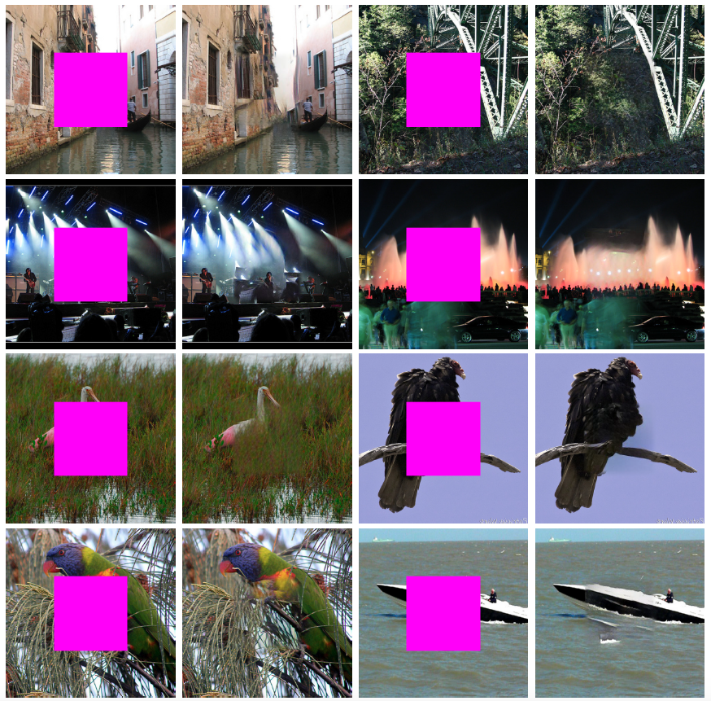

## High-Resolution Image Inpainting using Multi-Scale Neural Patch Synthesis

**[update 10/10/2017]** Example of photo editing using inpainting at the [project website](http://www.harryyang.org/inpainting). 

**[update 9/30/2017]** We shared the inpainting result of 200 ImageNet images and 100 Paris StreetView Images at the [project website](http://www.harryyang.org/inpainting). 

**[update 9/16/2017]** We increase the speed of original version by 6x (30s/image on GPU). 

**[update 9/16/2017]** All raw images of the paper and supplementary material (including input, output and intermediate results) are available at the [project website](http://www.harryyang.org/inpainting).



**[Faster Inpainting Updates]**:

1. We remove layer 12 of vgg in texture optimization.
2. In texture optimization, we have three scales and 100 iterations at each scale. Now it only computes the nearest patch at the first iteration of each scale, and re-use the nearest index in later iterations.

This greatly increases the speed at the cost of very subtle inpainting quality. 

This is the code for [High-Resolution Image Inpainting using Multi-Scale Neural Patch Synthesis](https://arxiv.org/pdf/1611.09969). Given an image, we use the content and texture network to jointly infer the missing region. This repository contains the pre-trained model for the content network and the joint optimization code, including the demo to run example images. The code is adapted from the [Context Encoders](https://github.com/pathak22/context-encoder) and [CNNMRF](https://github.com/chuanli11/CNNMRF). Please contact [Harry Yang](http://www.harryyang.org) for questions regarding the paper or the code. Note that the code is for research purpose only.

### Demo

(The code may give better results when supplying 32 different images (a batch) as input to the content network rather than using one single image as input. This may be due to the mismatch of the training and testing coefficients in batch normalization.)

- Install Torch:  http://torch.ch/docs/getting-started.html#_

- Clone the repository
```Shell
  git clone https://github.com/leehomyc/High-Res-Neural-Inpainting.git
```

- Download the [pre-trained models](https://drive.google.com/open?id=0BxYj-YwDqh45XzZVTXF1dnJXY28) for the content and texture networks and put them under the folder models/.

- Run the Demo
```Shell
  cd High-Res-Neural-Inpainting
  # This will use the trained model to generate the output of the content network
  th run_content_network.lua
  # This will use the trained model to run texture optimization
  th run_texture_optimization.lua
  # This will generate the final result
  th blend.lua
```


### Citation

If you find this code useful for your research, please cite:

```
@InProceedings{Yang_2017_CVPR,
author = {Yang, Chao and Lu, Xin and Lin, Zhe and Shechtman, Eli and Wang, Oliver and Li, Hao},
title = {High-Resolution Image Inpainting Using Multi-Scale Neural Patch Synthesis},
booktitle = {The IEEE Conference on Computer Vision and Pattern Recognition (CVPR)},
month = {July},
year = {2017}
}
```


